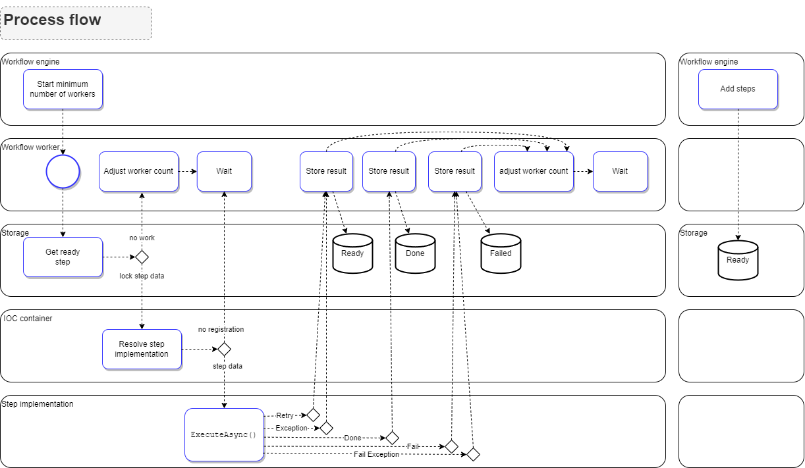
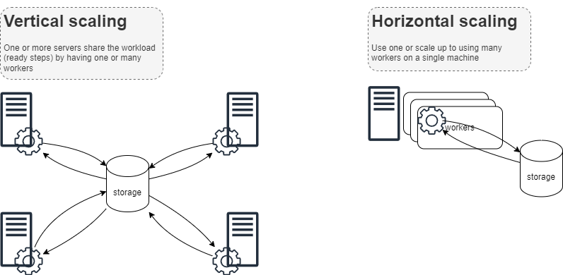

# Micro Workflow .net 
<!--start-->
[]()
[]()
[]()
<!--end-->

<p align="center"> </p>

Micro Workflow is a very fast, small, embedable and distributed workflow system primarily for .Net developers.

The code base is so small every one can read and understand the inner workings if necesarry.

# 1. Why use Micro Workflow

You should consider using Micro Workflow for one or more of the following reasons. 
* When you have a need for a queue, 
* scheduling and re-scheduling of code to be executed
* distributing load across multiple servers
* or a business process that needs to be robust (have it being broken up into steps and its progress persisted). 

We provide many examples in ["integration patterns"](https://github.com/kbilsted/MicroWorkflow.net/tree/feature/doc?tab=readme-ov-file#5-integration-patterns) on how to get started.

Design philosophy

**Simplicity** 
* We model only the steps in a workflow, *not* the transitions between them 
    * This greatly *simplifies* the model, especially when dealing with change and versioning 
    * It enables you to use reusable code blocks for determining a transition
* It is *easy* to embed micro workflow directly into your solutions to improve resiliance or use as a stand-alone workflow

**We use C# all the way**
* We don't want to invent a new language for the workflow - we love C#!
* Workflow code is *readable*, *debugable*, and *testable* - like the rest of your code base.
* You can use existing best practices for logging, IOC containers etc. of your choice
* Workflow code is just C# so it is *easy to commit and merge* using your existing *branching strategies*
* You *do not* need a special graphical editor for specifying flows

**The datamodel is simple - just three DB tables** 
* If things break in production, it is easy for you to figure out what has happened and remedy the problem
* You can reason about the consequences of versioning the step implementations vs. simply change the existing flows

**Distributed mindset**
* Supports *Fail-over setup* To improve up-time applications/integrations are often running on multiple servers at the same time. This is a common scenario is supported with no special setup.
* Supports incremental deployments across multiple instances, meaning the roll-out is gradual. Hence we support that steps may be added that is only known to a sub-set of the running workflows.

**Scalable** 
* You can add more workers in the workflow engine (vertical scaling)
* You can add more servers each running a workflow engine (horizontal scaling)

**No external dependencies** 
* The core library has *no external dependencies*, you can use whatever database, logger, json/xml/binary serializer you want ... in any version you want
* To get you quickly started, we supply nuget packages for "Newtonsoft Json", "Ado .Net Db", and "Autofac IOC". The packages are completely optional.


# 2. Overview



Supported scalabilities




# 3. Getting started

To define a workflow with the two steps, a `FetchData` step that fetches some data, and a `AnalyzeWords` step that analyzes the data, we implement interface `IStepImplementation` twice. 
To transition from one step to another, the step uses `return Done()`. This tells the engine that the current step has finished sucesfully. You can supply one or more steps that will be executed as a result of the success. 
This is how you control ordering of events.

There are no restrictions on the names of steps, but we found using a scheme similar to REST api's to be beneficial. Hence using the following format `{version}/{business domain}/{workflow name}/{workflow step}`. By defining the name of the flow as a `public const` it is easy to "find usage" inside the code base and to ensure no mis-spelling. Two workflow steps cannot have the same name.

```C#
[StepName(Name)]
class FetchData : IStepImplementation
{
    public const string Name = "v1/demos/fetch-word-analyze-email/fetch";

    public async Task<ExecutionResult> ExecuteAsync(Step step)
    {
        var url = step.State;
        var result = await new HttpClient().GetAsync(url);
        var content = result.Content.ReadAsStringAsync();

        return step.Done()
                .With(new Step(AnalyzeWords.Name, content));
    }
}

[StepName(Name)]
class AnalyzeWords : IStepImplementation
{
    public const string Name = "v1/demos/fetch-wordanalyze-email/process";

    public async Task<ExecutionResult> ExecuteAsync(Step step)
    {
        ...        
        return step.Done();
    }
}
```

And then to start everyting we instantiate a workflow engine and add concrete steps

```C#
var engine = new WorkflowEngine(...);
engine.Data.Add(new Step(FetchData.Name, "https://www.acme.company/rss"));
``` 


Below are some more elaborate exaples.


**Simple console demo**

A fully working C# example in one file: https://github.com/kbilsted/MicroWorkflow.net/blob/master/src/Demos/ConsoleDemo/Program.cs


**Webapi demo**

Now that you have understood the basics, lets make an example using a real IOC container and a database see https://github.com/kbilsted/MicroWorkflow.net/tree/master/src/Demos/WebApiDemo


**IOC container**

You can use any IOC container that supports named instances. We use Autofac. For more information see https://github.com/kbilsted/MicroWorkflow.net/tree/master/src/Product/MicroWorkflow.Ioc.Autofac


### Database

You likely want to persist workflows in a database. We currently use Microsoft SQL Server in production environments, but and SQL database should be easy to get working. For more information see https://github.com/kbilsted/MicroWorkflow.net/tree/master/src/Product/MicroWorkflow.AdoPersistence


# 4. Core concepts in Micro Workflow

The model revolves around the notion of a *step*. A step is in traditional workfow litterature referred to as an activity. Where activities live in a workflow. The workflow has identity and state and so forth. 
In Micro Workflow, however, there is only a `FlowId` property. No modelling of transitions nor workflow state. It is often desireable to store state around your business entities, in fact it is highly encouraged that you keep doing this. 


A *step* has the following properties

* A step has a *name* that identifies what code to execute when the steps executes
* A step has a *state* which can be deserialed during execution and is serialized after execution. It is not uncommon that it simply holds a reference to data in other database tables.
* A *schedule date* that denote the earliest execution time of the step. 
* A *singleton* flag denoting that only a single step with that name can exist in the ready queue. This is useful for monitoring steps or scenarios where multiple servers are in use.
* A step lives in either of 3 queues: 
    * *ready* (execution has not yet started, or the step has executed with errors and is automatically retried).
    * *failed* (execution is given up and not retried), 
    * *done* (succesful execution).
* During a step execution a step can spawn one or many new steps. Hence forming a chain or a graph of things to do. These steps execute after the current step. 
* Each step has a number of *tracking fields* such as create date, execution time, correlation id, flow id, created by id.
* There are a few more fields, they are all documented here https://github.com/kbilsted/MicroWorkflow.net/blob/master/src/Product/MicroWorkflow/Step.cs


Orthogonal to the step data we have *step implementations*. 

* These are code blocks with names.
* An implementation may have multiple names, this is very useful in a number of situations
  * When reusing step implementations across versions or across multiple workflows
  * when refactoring step names 
  * It provides better loggin context information, for example, rather than using a generic name like "send email", we can use a descriptive name  "v1/customer-onboarding/send-email" and "v1/customer-churn/send-email", making it easy to identify which flows and business impact on failure..


Operations you can do on steps

* A ready step may be *activated* meaning that it changes scheduling time, and activation parameters may be given.
* A done/failed step may be re-executed, by making a copy of it and adding it to the ready queue.


# 5. Integration patterns

We discuss some of the typical integration patterns between services


## A queue with unlimited retries and no strict FIFO ordering 

A queue implementation where elements are placed in a persistent storage and processed one by one. In case of an error, the element is retried later whilst other elements are processed. This queue is mostly FIFO (first in first out), but due to the nature of the retry, it is not guaranteed.

This implementation is also known as an "outbox pattern".

The Micro Workflow uses a dynamic number of workers for execution so scale up easily.

The implementation roughly

```C#
[StepName(Name)]
class SendMemberEnrollmentToAcmeCompany(HttpClient client) : IStepImplementation
{
    public const string Name = "v1/Send-member-enrollment-to-Acme-company";

    public async Task<ExecutionResult> ExecuteAsync(Step step)
    {
        var result = await client.PostAsync("...", null);
        result.EnsureSuccessStatusCode();
        return step.Done();
    }
}
```


## A queue with limited and intelligent retries and no strict FIFO ordering 

Similar to the above example except

We retry only 5 times, and we retry only if the receiving service fails with a http 500 range. A http 400 range signals the payload is wrong and thus we fail the job.


```C#
[StepName(Name)]
class SendMemberEnrollmentToAcmeCompanyLimitedRetry(HttpClient client) : IStepImplementation
{
    public const string Name = "v1/Send-member-enrollment-to-Acme-company-limited-retry";

    public async Task<ExecutionResult> ExecuteAsync(Step step)
    {
        if (step.ExecutionCount >= 5)
            return step.Fail("too many retries");

        var result = await client.PostAsync("...", null);

        switch ((int)result.StatusCode)
        {
            case >= 200 and < 300: 
                return step.Done();

            case >= 400 and < 500: 
                return step.Fail("Wrong payload " + result.ToString());

            case >= 500:
                return step.Rerun(description: $"Upstream error {result}");

            default: throw new NotImplementedException(); 
        }
    }
}
```


## A queue that may only perform operations in a limited time window

Some integrations are prohibited from running 24/7. For examples systems running nightly batch processing. Similar, integration with customers are sometimes implemeted such that the customer is not disturbed in the middle of the night with notifications but only within "reasonable hours" e.g between 7-20.

```C#
[StepName(Name)]
class SendMemberEnrollmentToAcmeCompanyLimitedTimewindow() : IStepImplementation
{
    public const string Name = "v1/Send-member-enrollment-to-Acme-company-limited-from-0700-to-2000";

    public async Task<ExecutionResult> ExecuteAsync(Step step)
    {
        // ensure window of 0700 - 2000
        var now = DateTime.Now;
        if (now.Hour < 7)
            return step.Rerun(scheduleTime: now.Date.AddHours(7));

        if (now.Hour >= 20)
            return step.Rerun(scheduleTime: now.Date.AddDays(1).AddHours(7));

        // ... do stuff

        return step.Done();
    }
}
```


## A scheduled task Once every hour tp fetch latest data from source

For this scenario to work we run the same code block over and over again with a set interval. We utilize that a step may defined as `singleton` meaning that it can only exist once in the ready queue. Thus we cannot 
accidently add the step twice (i.e. in a distributed environment). We use `AddStepIfNotExists()` but could have used `Add()` with a `try..catch`.

```C#
public void ScheduleDataFetch(WorkflowEngine engine)
{
    var step = new Step(ScheduledFetchDataOnceAnHour.Name)
    {
        Singleton = true,
        ScheduleTime = DateTime.Now.Date.AddHours(DateTime.Now.Hour)
    };

    engine.Data.AddStepIfNotExists(step, new SearchModel(Name: ScheduledFetchDataOnceAnHour.Name));
}
```

And for fun, we fail the step if it has not been created correctly, to ensure we don't mess up.

```C#
[StepName(Name)]
class ScheduledFetchDataOnceAnHour() : IStepImplementation
{
    public const string Name = "v1/fetch-data-from-acme-once-an-hour";

    public async Task<ExecutionResult> ExecuteAsync(Step step)
    {
        if (!step.Singleton)
            throw new FailCurrentStepException("Must be a singleton step!");

        // ... fetch data

        return step.Rerun(scheduleTime: step.ExecutionStartTime!.Value.AddHours(1));
    }
}
```


# 6. Performance 

Simplicify is the focus of the code base. Performance is simply a side-effect of keeping things simple. 

On a 2020 mid-tier computer we execute 10.000/sec steps using a single Workflow engine with 8 workers and an un-optimized SQL Server instance. 

Your milage may wary, so I highly recommend you do your own measurements before jumping to any conclusions. 
You can take outset in some simple test scenarios at https://github.com/kbilsted/MicroWorkflow.net/blob/master/src/Demos/MicroWorkFlow.Tests/PerformanceTests.cs


# 7. Flow versioning

Since each step may be regarded as being part of a flow, or as a single independent step, there is no notion of versions. However, you can use a version number in steps (similar to using version in REST api's). 
This enable you to create a new version with new steps that has a different implementation to the old. 
This way existing steps can operate on the old code, and new steps operate on the new code. 
If all steps need to execute on the new code, simply use multiple step names for the new implementation that match the two versions.


# 8. Retries and ordering 
The automatic retry of a step in case of a failure is key feature. You can control ordering to some degree by putting longer and longer delays when retrying a failing step. This technique is sometimes called exponential back-off, since the time between retries exponentially increase to ensure throughput of succesful jobs. The default retry delay is calculated as `delay = retries^3 seconds`. 

If you want to stop retrying either return a `step.Fail()` or `throw FailCurrentStepException`.

Step execution is only orderes by an earliest execution time. If you need to control that step "B" execute before step "C". Then from step "A" spawn a step "B", and in step "B" spawn a step "C".


# 9. Micro Workflow and related concepts 
Another way to gain conceptual insights into the framework, we explain why Micro Workflow is a good implementation fit to many concepts.


### Micro Workflow as a Queue
You may not think of Micro Workflow as a queue since the step execution is unordered. Queue's are asociated with FIFO - First In First Out. 
A consequence of FIFO is that when queue elements can fail and retry, the FIFO property will stop the entire queue. For most real life scenarios this is unacceptable, hence most
queues are in fact not FIFO.

Thus we can implement a queue as a a workflow with only one step. 


### Micro Workflow as a Job scheduler
The system can act as a job scheduler. A step can be scheduled for a certain time and re-executed again at a certain time. To ensure only one instance exist, use the `Singleton` attribute.


### Micro Workflow as the 'outbox pattern'
The *outbox pattern* is an implementation strategy you often read about when dealing with
events or distributed systems. It is a way to ensure that notifying other systems of a change happens in the same transaction
as the change itself. The implementation is simply to insert a row into a queue that notifies the other system. 

This is exactly a one-to-one match with a step in Micro Workflow.

